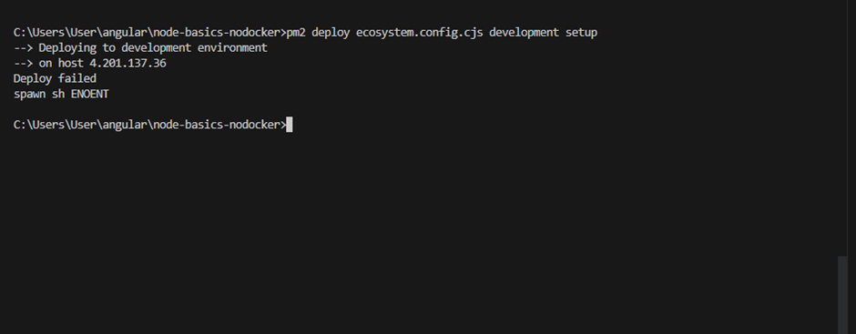

In this project, we are trying to load environment variables for a particular environment using dotenv.
We are not using docker. We are just using pm2.

Steps:

1. npm init. Add "type":"module" in package.json to declare all .js files as ES6 modules.
2. Add src folder with app.js
3. Install express and install dotenv as dev dependency. pm2 is already installed globally.
4. Run "pm2 ecosystem" to generate ecosystem.config.js. Rename to ecosystem.config.cjs because it is a
Common JS module and not ES6 module.

In this file,

    append_env_to_name: true, // <===== add this line
    This ensures I can run multiple environments of the application on the same server.
    This property appends the environment name passed to the --env flag to the name of the app.
    The name of the app comes from "name" field in the same file.
    

env:{
      NODE_ENV:'production'
    },
means that all environments by default will take NODE_ENV as 'production'. This is a great place to define defaults.

Next moving to environment specific variables. Here i have just defined those variables necessary for
dotenv to function.

  env_development:{
      DOTENV_CONFIG_PATH:'.env.development'
    },
    env_production:{
      DOTENV_CONFIG_PATH:'.env.production'
    },

DOTENV_CONFIG_PATH is a variable defined to indicate to dotenv
package which .env file to pick.

We are storing all other variables in .env.development and .env.production files in the root of the project. These files will not be committed into the source control. They will be mentioned in the 
.gitignore file so that any sensitive information is not leaked.

APP_ENV defines the target environment the app is running in.

.env.development

PORT=3000
APP_ENV=development
api-key=dev-api-key

.env.production

PORT=8080
APP_ENV=production
api-key=prod-api-key

Finally,     node_args:`-r dotenv/config`
We are executing the dotenv command here so that no dotenv code is required the src code.

5. Finally, in the package.json, we are running the application using the pm2 commands.

 "pm2-dev-local": "pm2 start ecosystem.config.cjs --env development",
"pm2-prod-local": "pm2 start ecosystem.config.cjs --env production"

6. You can deploy the app via pm2 only from git bash otherwise you will get the below error:

So open git bash, navogate to root of project and execute the below commands to deploy to development
and production respectively

pm2 deploy ecosystem.config.cjs development update
pm2 deploy ecosystem.config.cjs production update

7. Before deployment ensure, you have Node and npm installed on the remote server. If its a linux server,
login into the server via cmd

ssh asureuser22@4.201.137.36

execute the below commands:

sudo apt-get update
sudo apt-get install nodejs
sudo apt-get install npm

After this, install pm2 globally on the remote server

npm install -g pm2

8.Ensure you have created the folders inside /var/ and given chmod 777 access to the below directories before deployment because you
are deployling inside /var and other 2 folder also need to modified internally.

azureuser22@ramyaVM:/$ sudo chmod +777 /var/
azureuser22@ramyaVM:/$ sudo chmod +777 /usr/local/lib/
azureuser22@ramyaVM:/$ sudo chmod +777 /usr/local/bin/

Create the deployment folders like below. Do similarly for dev/onlypm2

azureuser22@ramyaVM:/var$ sudo mkdir prod
azureuser22@ramyaVM:/var$ cd prod
azureuser22@ramyaVM:/var/prod$ sudo mkdir onlypm2

9. 
pm2 takes care of connecting to the remote server, pulling the code from repo and then executing
the "post-deploy" code for installation and running the app.

10. Note that since .env files are not pushed into the repository, they wont be there when cloned into
remote server. Hence .env files are only for local use.
When deploying the app, the environment variables need to be configured on the remote server.
